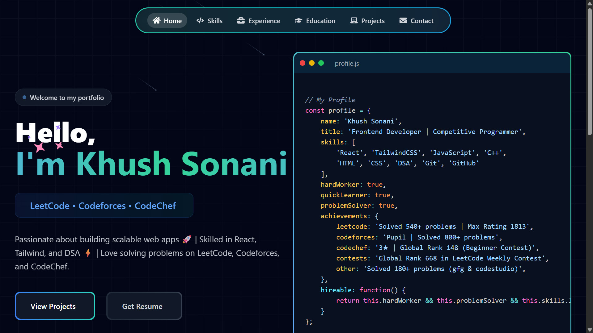

# Khush Sonani — Developer Portfolio

<div align="center">
  
</div>

<br />

Welcome to my **premium developer portfolio**! This site is designed to showcase my journey as a Full Stack Developer and Competitive Programmer. It features a modern dark-theme aesthetic with glassmorphism elements, high-performance animations, and a fully responsive layout.

🌐 **Live Preview:** [khushsonani.vercel.app](https://khushsonani.vercel.app/)

---

## 🚀 Features

- **Modern Aesthetic:** Premium dark theme with glassmorphism, subtle glowing gradients, and polished micro-interactions.
- **Smooth Animations:** Powered by **Framer Motion** and **GSAP** for entrance animations, hover states, and scroll-triggered reveals.
- **Fluid Scrolling:** Integrated with **Lenis** for a buttery-smooth scrolling experience.
- **Interactive UI:** Custom floating navbar, magnetic buttons, tilt-cards, and animated stats counters.
- **Fully Responsive:** Mobile-first design that looks perfect on all screen sizes, featuring a custom animated mobile drawer menu.

---

## 🛠️ Technologies Used

- **Frontend Framework:** React.js + Vite
- **Styling:** Tailwind CSS
- **Animations:** Framer Motion, GSAP
- **Scroll Handling:** Lenis (Studio Freight)
- **Icons:** React Icons
- **Deployment:** Vercel

---

## 📂 Portfolio Sections

1. **Hero:** Introduction with dynamic typewriter effect, floating stat badges, and my professional profile photo.
2. **About:** A deeper dive into my background, focus areas, and current education at Nirma University.
3. **Skills:** Categorised technical skills displayed with animated progress bars and tooltips.
4. **Experience:** Professional journey, including my time as a Software Engineering Intern.
5. **Projects:** Detailed showcases of my top projects (like RideSync) with tech stacks and repository links.
6. **Competitive Profiles:** My competitive programming journey, featuring my LeetCode Knight and CodeChef 3★ ratings.
7. **Leadership & Achievements:** A timeline of my major milestones, including winning the CPL 2026 Championship.
8. **Contact:** Interactive contact form and quick links to my social profiles.

---

## 💻 Getting Started (Local Development)

If you'd like to run this project locally on your machine:

### 1. Clone the repository
```bash
git clone https://github.com/KhushSonani/Portfolio-Khush-Sonani.git
```

### 2. Navigate to the directory
```bash
cd Portfolio-Khush-Sonani
```

### 3. Install dependencies
```bash
npm install
```

### 4. Start the development server
```bash
npm run dev
```

Open your browser and visit `http://localhost:5173` to see the live result! 🎉

---

## 📬 Connect with Me

- **LinkedIn:** [linkedin.com/in/khush-sonani-b9b056290](https://www.linkedin.com/in/khush-sonani-b9b056290/)
- **GitHub:** [@KhushSonani](https://github.com/KhushSonani)
- **LeetCode:** [khushsonani](https://leetcode.com/u/khushsonani/)
- **Email:** khushsonani2005@gmail.com

---

<div align="center">
  Designed & Built by <b>Khush Sonani</b>
</div>
