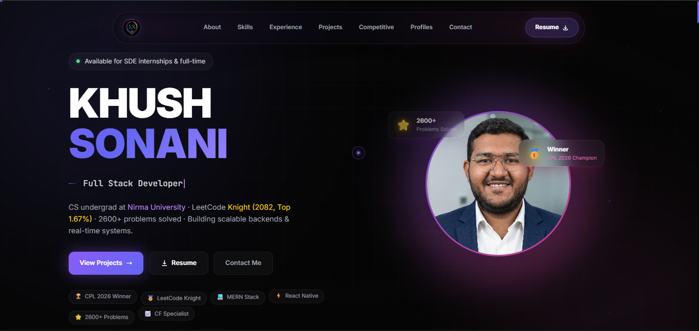

# 🚀 Khush Sonani — Portfolio

<div align="center">

### Modern Developer Portfolio built with React, Vite & Tailwind CSS

<p>
<a href="https://portfolio-khush-sonani.vercel.app/">

</a>

<a href="https://github.com/KhushSonani/Portfolio-KD">

</a>
</p>



</div>

---

## 📖 Overview

This repository contains the source code for my personal developer portfolio.

The portfolio is designed with a premium dark aesthetic, smooth animations, and a responsive user experience. It showcases my projects, technical skills, competitive programming achievements, leadership experience, and professional journey in a clean and interactive format.

**Live Website**

👉 **https://portfolio-khush-sonani.vercel.app/**

---

# ✨ Features

* Premium modern UI
* Dark theme with glassmorphism
* Responsive design
* Smooth scrolling
* Scroll-triggered animations
* Interactive components
* Animated statistics
* Project showcase
* Competitive programming profile
* Leadership & achievements section
* Optimized performance
* SEO-friendly configuration

---

# 🛠 Tech Stack

| Category      | Technologies        |
| ------------- | ------------------- |
| Frontend      | React, Vite         |
| Styling       | Tailwind CSS        |
| Animation     | Framer Motion, GSAP |
| Smooth Scroll | Lenis               |
| Icons         | React Icons         |
| Deployment    | Vercel              |

---

# 📁 Project Structure

```text
Portfolio-KD
│
├── public/
│   ├── preview.png
│   ├── resume.pdf
│   ├── robots.txt
│   └── sitemap.xml
│
├── src/
│   ├── assets/
│   ├── components/
│   │   ├── layout/
│   │   └── ui/
│   │
│   ├── hooks/
│   ├── lib/
│   ├── sections/
│   ├── App.jsx
│   └── main.jsx
│
├── index.html
├── package.json
├── vite.config.js
└── tailwind.config.js
```

---

# 🚀 Getting Started

Clone the repository

```bash
git clone https://github.com/KhushSonani/Portfolio-KD.git
```

Navigate to the project

```bash
cd Portfolio-KD
```

Install dependencies

```bash
npm install
```

Run locally

```bash
npm run dev
```

Build for production

```bash
npm run build
```

Preview production build

```bash
npm run preview
```

---

# 📦 Deployment

The portfolio is deployed on **Vercel**.

Every push to the `main` branch automatically triggers a new production deployment.

---

# 📸 Preview

The homepage showcases:

* Hero section
* Animated navigation
* About
* Skills
* Experience
* Featured projects
* Competitive programming achievements
* Leadership timeline
* Contact section

---

## ⭐ If you found this project interesting, consider giving it a star.
